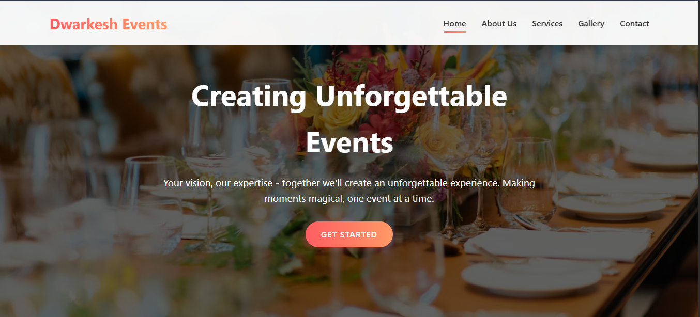

# ✨ Dwarkesh Events ✨

A Django-based web application for managing events, gallery, and services for Dwarkesh Events. 🎉

## 🚀 Features

- 🏠 Home page with event showcase
- 🖼️ Gallery of past events
- 🛎️ Services offered
- 📝 Contact form for inquiries
- ℹ️ About page

## 💻 Technologies Used

- 🐍 Django
- 🎨 HTML/CSS
- 🗃️ SQLite (for development)

## 🛠️ Setup and Installation

1. 📥 Clone the repository

   ```
   git clone https://github.com/udaygiri/dwarkesh-events.git
   cd dwarkesh-events
   ```

2. 🔧 Set up a virtual environment

   ```
   python -m venv venv
   venv\Scripts\activate
   ```

3. 📦 Install dependencies

   ```
   pip install -r requirements.txt
   ```

4. 🔄 Run migrations

   ```
   python manage.py migrate
   ```

5. 🚀 Start the development server
   ```
   python manage.py runserver
   ```

## 📂 Project Structure

- 📞 `contact/` - Contact form application
- 🖼️ `gallery/` - Image gallery application
- 📁 `media/` - User-uploaded files
- 🎨 `static/` - Static files (CSS, JavaScript, images)
- 📄 `templates/` - HTML templates

## 📱 Screenshots



## 👥 Contributing

Contributions are welcome! Please feel free to submit a Pull Request.

## 📞 Contact

For any inquiries or support, please reach out through the contact form on our website.

## 🙏 Acknowledgements

- Thanks to all contributors who have helped shape Dwarkesh Events
- Special thanks to our clients for their continued support

## 📜 License

This project is licensed under the MIT License - see the LICENSE file for details.
